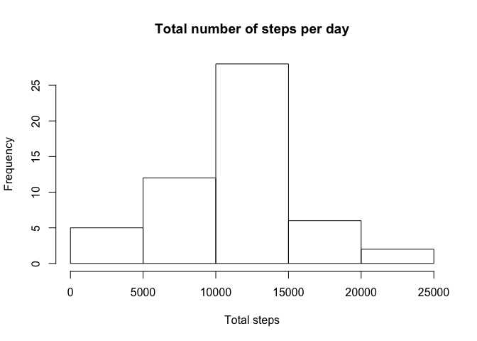

# Reproducible Research: Peer Assessment 1
___

## Loading and preprocessing the data
___
##### 1. Load the data (i.e. read.csv())


```r
library(ggplot2)
```

```
## Warning: package 'ggplot2' was built under R version 3.1.3
```

```r
library(lattice)
library(plyr)

# Set working directory to be forked RepData_PeerAssessment1 
unzip('activity.zip')
data <- read.csv('activity.csv')
```

##### 2. Process/transform the data (if necessary) into a format suitable for your analysis


```r
# format date
data$date <- as.Date(data$date)
```

## What is mean total number of steps taken per day?

#### For this part of the assignment, you can ignore the missing values in the dataset.

#### 1. Calculate the total number of steps taken per day


```r
data_rm <- na.omit(data)
stepsPerDay <-  ddply(data_rm, c("date"), summarize, sumSteps = sum(steps))
```

#### 2. Make a histogram of the total number of steps taken each day

```r
hist(stepsPerDay$sumSteps, main = "Total number of steps per day", xlab = "Total steps", ylab = "Frequency")
```

 

#### 3. Calculate and report the mean and median of the total number of steps taken per day

```r
mean(stepsPerDay$sumSteps)
```

```
## [1] 10766.19
```

```r
median(stepsPerDay$sumSteps)
```

```
## [1] 10765
```

## What is the average daily activity pattern?

#### 1. Make a time series plot (i.e. type = "l") of the 5-minute interval (x-axis) and the average number of steps taken, averaged across all days (y-axis)


```r
mean_interval <- ddply(data_rm, c("interval"), summarize, mean = mean(steps))
qplot(x = interval, y = mean, data = mean_interval, main = "Time Series: Average number of steps taken", xlab = "Interval (minutes)", ylab = "Average no of steps", geom = "line")
```

 

#### 2. Which 5-minute interval, on average across all the days in the dataset, contains the maximum number of steps?

```r
max <- which.max(mean_interval$mean)
maxInterval <- mean_interval[max,]
maxInterval$interval
```

```
## [1] 835
```


## Imputing missing values

#### 1. Calculate and report the total number of missing values in the dataset (i.e. the total number of rows with NAs)

```r
sum(is.na(data))
```

```
## [1] 2304
```

#### 2. Devise a strategy for filling in all of the missing values in the dataset. The strategy does not need to be sophisticated. For example, you could use the mean/median for that day, or the mean for that 5-minute interval, etc.

```r
# use mean interval value to replace missing values. note that each date-interval pair is unique

# join the mean_interval dataset with the original data by interval to create a new column for mean steps per interval
data_merge <- join(data, mean_interval, by = "interval")

# replace na values in new data table
data_merge$steps[is.na(data_merge$steps)] <- data_merge$mean[is.na(data_merge$steps)]
```

#### 3. Create a new dataset that is equal to the original dataset but with the missing data filled in.


```r
data_new <- data_merge[c("steps", "date", "interval")]
head(data_new)
```

```
##       steps       date interval
## 1 1.7169811 2012-10-01        0
## 2 0.3396226 2012-10-01        5
## 3 0.1320755 2012-10-01       10
## 4 0.1509434 2012-10-01       15
## 5 0.0754717 2012-10-01       20
## 6 2.0943396 2012-10-01       25
```

#### 4. Make a histogram of the total number of steps taken each day and Calculate and report the mean and median total number of steps taken per day. Do these values differ from the estimates from the first part of the assignment? What is the impact of imputing missing data on the estimates of the total daily number of steps?

```r
stepsPerDay_new <- ddply(data_new, c("date"), summarize, sumSteps = sum(steps))

hist(stepsPerDay_new$sumSteps, main = "Total number of steps per day", xlab = "Total steps", ylab = "Frequency")
```

 

```r
mean(stepsPerDay_new$sumSteps)
```

```
## [1] 10766.19
```

```r
median(stepsPerDay_new$sumSteps)
```

```
## [1] 10766.19
```
The new mean value does not differ, and the new median value differs only minorly from the first part of the assignment as the missing NA data was imputed using the steps for each interval averaged across all days. There is limited impact on imputing missing data on the estimates, especially since the imput was based on a total average across all days. 


## Are there differences in activity patterns between weekdays and weekends?

#### 1. Create a new factor variable in the dataset with two levels – “weekday” and “weekend” indicating whether a given date is a weekday or weekend day.

```r
# add new column of day names in original data set
data_day <- data_rm
data_day$day <- weekdays(data_day$date)
data_day$dayType <- ifelse(data_day$day == 'Saturday' | data_day$day == 'Sunday', 'Weekend', 'Weekday')
```

#### 2. Make a panel plot containing a time series plot (i.e. type = "l") of the 5-minute interval (x-axis) and the average number of steps taken, averaged across all weekday days or weekend days (y-axis). See the README file in the GitHub repository to see an example of what this plot should look like using simulated data.


```r
mean_interval_dayType <- ddply(data_day, c("dayType", "interval"), summarize, meanSteps = sum(steps))

xyplot(data = mean_interval_dayType, meanSteps ~ interval | dayType, xlab = "Interval", ylab = "Average number of steps", type = "l", layout = c(1,2))
```

 

